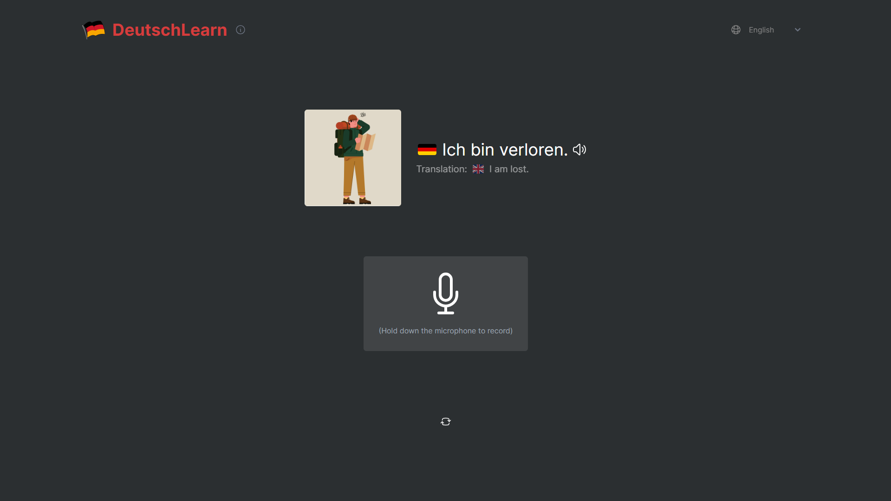

# Deutsch Learn

DeutschLearn is a language learning platform that is easy to navigate and use. It has text to speech feature that teach how the word is pronounced in deutsch and a speech recognition feature that allows users to record themselves speaking and compare their pronunciation to a native speaker. User can try to perfect their pronounciation by using DeutschLearn.
 